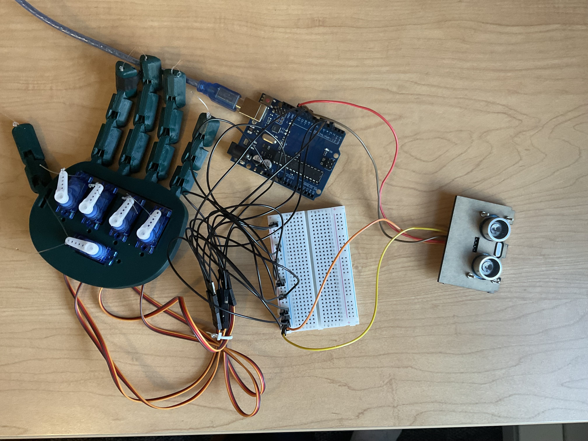

# Non-Contact Teleoperated Hand

## Overview

A robotic hand that closes and opens based on how far your hand is from an ultrasonic sensor — no physical contact with the controller needed. Built around an Arduino Uno driving five servos through a tendon-driven InMoov-style hand kit, with a single HC-SR04 as the input.

The idea came from wanting to try a non-contact control scheme (vaguely inspired by sterile surgical interfaces where the operator can't touch the tool). Most of the engineering work wasn't the concept though — it was making cheap hardware behave: filtering out sensor noise, smoothing servo motion, and keeping the USB power rail from browning out when five servos move at once.

## Hardware

- **Microcontroller:** Arduino Uno R3 (ATmega328P)
- **Sensor:** HC-SR04 ultrasonic (40 kHz)
- **Actuators:** 5× SG90 micro-servos, one per finger, tendon-driven with nylon cord
- **End-effector:** InMoov-style 3D-printed hand (kit), with rubber pads added to the fingertips for grip
- **Power:** USB 5V

## Pin Mapping

| Finger / Signal | Arduino Pin | Range |
|---|---|---|
| Ultrasonic Trigger | D11 | 10 µs pulse |
| Ultrasonic Echo | D12 | — |
| Thumb | D3 (PWM) | 90° → 175° |
| Index | D5 (PWM) | 90° → 180° |
| Middle | D6 (PWM) | 90° → 0° |
| Ring | D9 (PWM) | 90° → 0° |
| Pinky | D10 (PWM) | 90° → 0° |

All servos share a common ground with the Uno.

## How It Works

The main loop runs at 20 Hz: read the ultrasonic sensor, map the distance to a servo position, and update the five fingers. The active range is 5–20 cm — hand closed at 5 cm, fully open at 20 cm, linear in between.

Three things sit between the raw sensor reading and the servo output:

### Glitch filter

The HC-SR04 occasionally returns 0 when a ping times out or gets absorbed by a soft surface. Acting on those directly would make the hand snap open every few seconds. The firmware rejects zero readings and only falls back to the "open" state after 5 consecutive bad frames in a row, which is long enough to ignore dropouts but short enough to respond when the operator actually leaves the workspace.

### Motion smoothing

Mapping sensor distance directly to servo angle produces twitchy, jerky motion — small hand movements translate into big servo jumps. Instead, the firmware updates each servo toward its target by a fixed increment per loop (`speedLimit = 0.8°`), which enforces a constant-velocity profile. The practical effect is that the hand can grip deformable objects without crushing them.

### Staggered actuation

Driving five SG90s simultaneously pulls more than 1.2 A at peak, which is enough to brown out a USB 5V rail. The firmware updates fingers in sequence with a 50 ms delay between each one, spreading the current draw over time. The motion still looks simultaneous to a human observer but the power supply sees five smaller spikes instead of one big one.

## Testing

Ran pick-and-place trials on three objects to check grip behaviour:

| Object | Result (10 trials) | Notes |
|---|---|---|
| Cardboard roll | 10/10 | Easy — rigid, good friction |
| Paper ball | 10/10 | Motion smoothing kept it from being crushed |
| Plastic cup | 9/10 | Low-friction surface, fingertip rubber pads made the difference |

## Challenges

**Sensor noise.** Early versions jittered constantly because the HC-SR04 was picking up reflections off the operator's clothing and occasional dropouts. Adding input clamping (only act on 5–20 cm readings) and the zero-reading debounce cleaned it up.

**Power brownouts.** First version tried to drive all five servos in parallel and kept resetting the Arduino every time the hand closed. Figured out it was a current spike issue by watching the 5V rail on a scope. Staggering the servo updates fixed it without needing an external power supply.

**Tendon tensioning.** Getting all five fingers to close evenly took a lot of trial and error on the nylon cord tension. Too loose and the finger doesn't fully close; too tight and the servo stalls at the end of travel.

## Future Improvements

- **External power.** A dedicated 5V supply for the servos (with a shared ground) would remove the need for staggered actuation and allow faster, more natural hand motion.
- **Per-finger control.** A camera-based input (e.g. MediaPipe hand tracking) could give independent finger positions instead of a single open/close axis.
- **Closed-loop feedback.** Adding force-sensitive resistors at the fingertips would let the hand detect when it's gripped an object and stop closing, rather than relying on motion smoothing to avoid crushing.
- **Non-blocking firmware.** Same story as my other projects — the current code uses `delay()` for the staggered actuation, which blocks the sensor loop. A `millis()`-based scheduler would let the hand keep reading input while moving.
